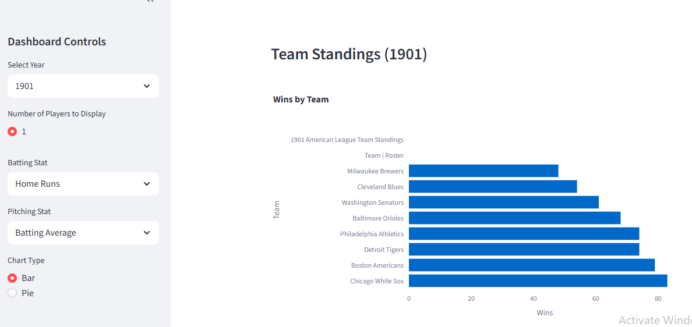
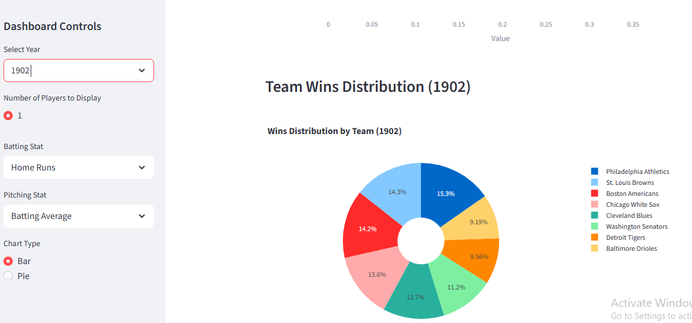

# Capstone Local Scraping Project
This repository contains four Python programs that work together to collect, store, and display baseball data in an interactive dashboard. This interactive dashboard created based on: https://www.baseball-almanac.com/yearmenu.shtml

## Structure
**Web Scraping Program** To collect the data from the web
**Import SQL Program** Loads the scraped data into a SQL database
**Query Program** Runs Queries on the database
**Dashboard Program** Visualize the data and create a Streamlit dashboard

## Deployment
Only the Dashboard program is deployed using Streamlit: (https://streamlit.io/)

## Branches
This repository used only one branch: **Main**

### How to run the dashboard
'''bash
streamlit run dashboard/baseball.py

## Dashboard Preview

